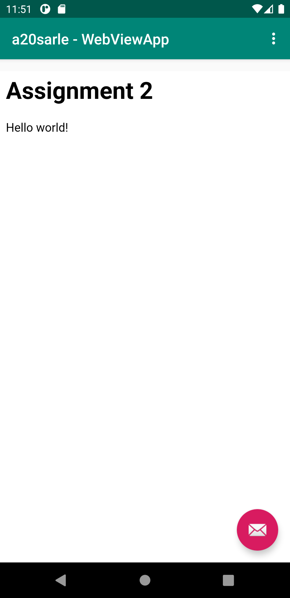
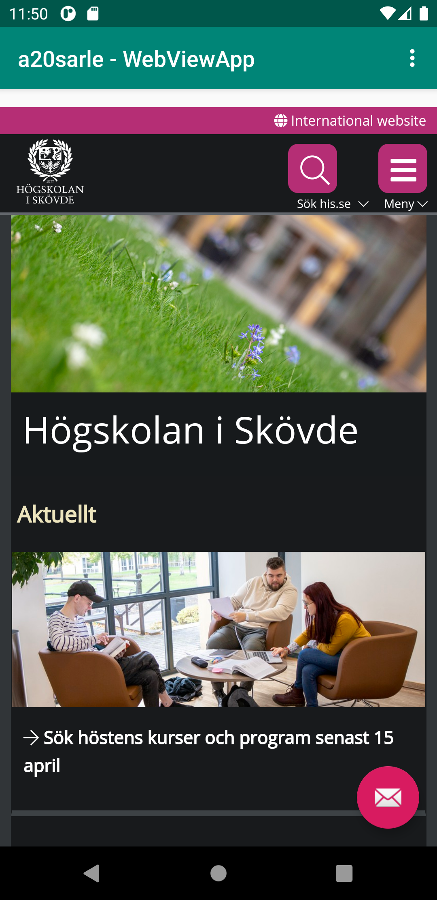

# Rapport för uppgift 2: WebView

Applikations namnet ändrades genom att byta ut namnet i den första string:en i res>vlues>strings.

Tillgång till internet accepterades genom användnig av kodsnutten ```<uses-permission android:name="android.permission.INTERNET" />``` i filen AndroidManifest.xml.

Genom att ersätta textView-elementet med WebView-elementet nedan skapades den efterfrågade WebView:n. Detta gjordes  i res>layout>content_main.xml. För att ändra WebView:ns ID byttes ```android:id="@+id/webview``` ut till ```android:id="@+id/my_webview"```.
```
<WebView
        android:id="@+id/my_webview"
        android:layout_width="match_parent"
        android:layout_height="match_parent"
        />
```

I samband med kodraderna nedan skapades Private Member Variable med typen WebView där den sista kodraden vilken lokaliserar WebView-elementet lades i funktionen OnCreate().
```
import android.webkit.WebView;
private WebView myWebView;
myWebView=findViewById(R.id.my_webview);
```

För att tillåta JavaScript användes koden nedan i MainActivity.java.
```
import android.webkit.WebSettings;
WebSettings webSettings = myWebView.getSettings();
webSettings.setJavaScriptEnabled(true);
```

För att skapa assignment2.html skapades först en ny asset-mapp och därefter skapades .html filen. Genom koden nedan länkades sedan den interna sidan till appen och för att kunna visa allt innehåll ändrades även marginTop i content_main.xml.
```
WebViewClient myWebViewClient = new WebViewClient(); //internal
myWebView.setWebViewClient(myWebViewClient); //internal
myWebView.loadUrl("file:///android_asset/assignment2.html"); //internal
```
```
android:layout_marginTop="72dp"
```
assignment2.html visades slutligen på följande vis i applikationen.


Genom kodraden ```myWebView.loadUrl("https://www.his.se/");``` kunde även den externa sidan visas i applikationen vilken tillslut visades på följande vis.


Länkarna för den interna och externa sidan lades i var sina funktioner som sedan kallas då användaren klickar på något av manyvalen.
